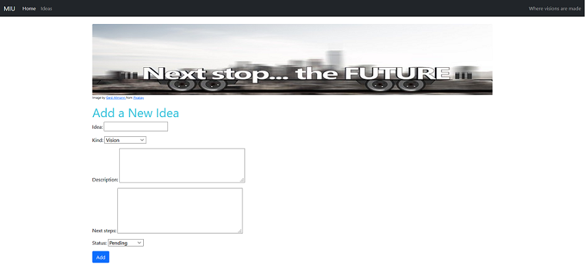
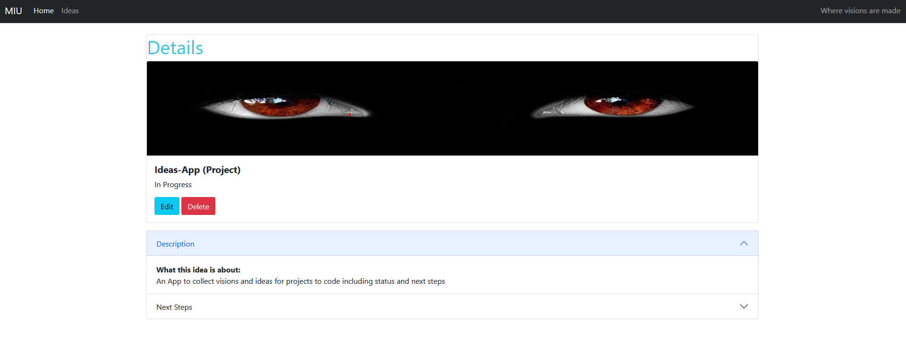
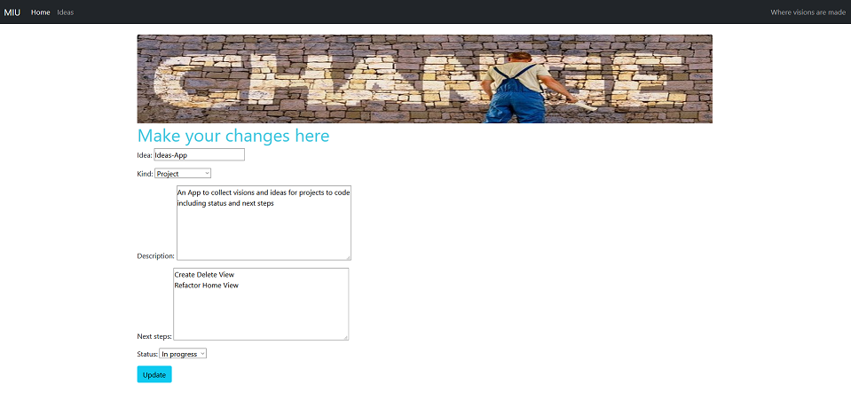

# MIU

## Magical Idea Universe


A Django app that helps you manage and keep track of your ideas and visions.


Sort your ideas according to their name, kind (project, vision, try something), status (pending, in progress, completed), idea description and next steps.

## Create View

Add new ideas to the database.


## Detail View

The detail view shows you the details of an idea


## Update View

Via the update view you can edit the details of your selected idea.


## How to use locally on your computer

- Fork/Clone this repository
- Download and install [Python](https://www.python.org/downloads/)
- install Pipenv

```
pip3 install pipenv
```

- open the project folder in your bash and install the latest version of Django with Pipenv

```
pipenv install django
```

Activate the virtual environment

```
pipenv shell
```

- In the project folder create a file named .env on the same level as the manage.py file
- Get a secret key (for example on https://miniwebtool.com/django-secret-key-generator/)
- Enter the secret key **in the .env file** inside the <> like this (your secret key goes where it says 'secret_key'):

```
export SECRET_KEY='<secret_key>'
```

- Migrate

```
python manage.py makemigrations ideas
```

```
python manage.py migrate
```

- Start the server

```
python manage.py runserver
```

If everything has worked your shell should provide you with the address with which to open the app in your browser (http://127.0.0.1:8000/)

## This is a pet project to play around with Django. It is a work-in-progress and will be updated continuously.
