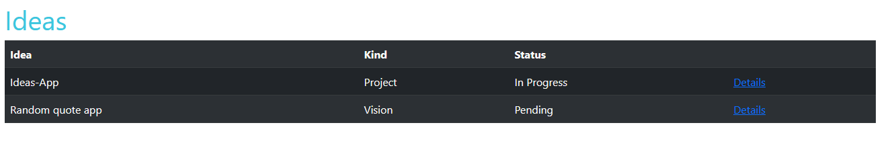

# MIU

## Magical Idea Universe


A Django app that helps you manage and keep track of your ideas and visions.



Sort your ideas according to their name, kind (project, vision, try something), status (pending, in progress, completed), idea description and next steps.

## Detail view

The detail view shows you the details of an idea


## Update View

Via the update view you can edit the information on your selected idea.


## How to use locally on your computer

- Install Python
- Install the latest version of Django (I recommend doing so in a virtual environment for the project, I use pipenv for that)

```
pipenv shell
```

```
pipenv install django
```

- Create file named .env
- Get a secret key (for example on https://miniwebtool.com/django-secret-key-generator/)
- enter the secret key in the .env file like this (enter your secret key where it says 'secret_key'):

```
export SECRET_KEY='<secret_key>'
```

- migrate

```
python manage.py makemigrations ideas
```

```
python manage.py migrate
```

- Start the server

```
python manage.py runserver
```
