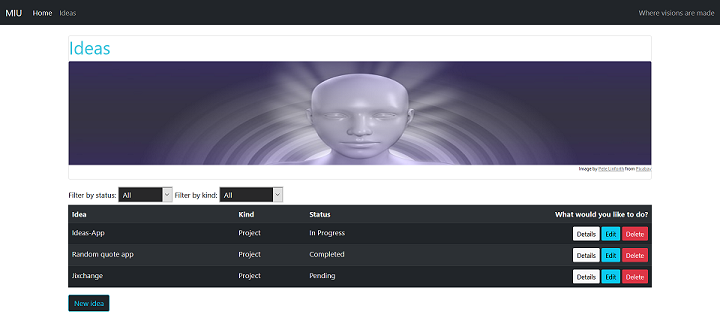
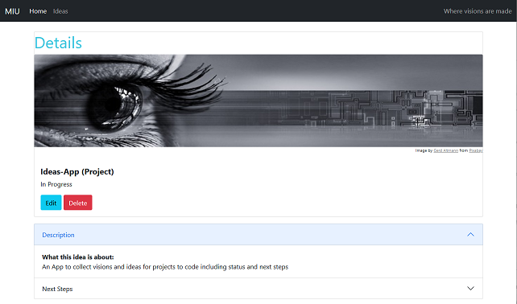
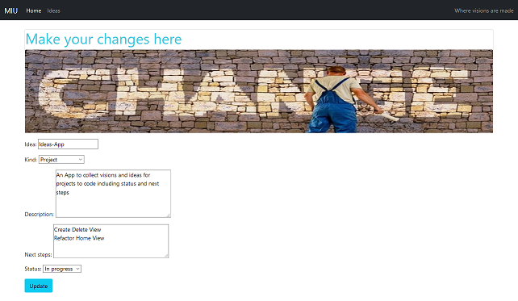
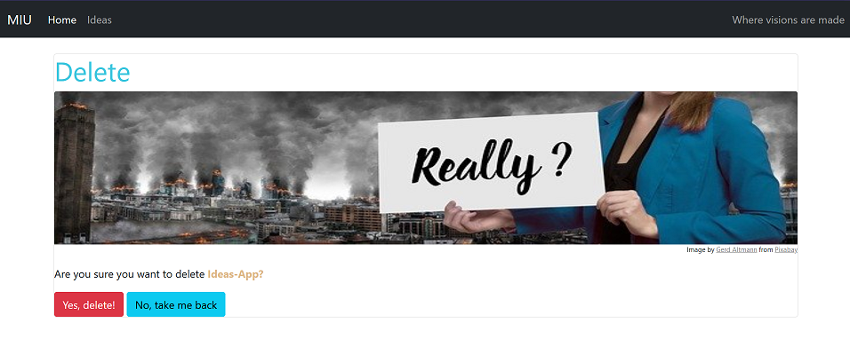

# MIU

## Magical Idea Universe


A Django app that helps you manage and keep track of your ideas and visions with full CRUD functionality.
Keep track of your ideas and visions and sort them by their name, kind of idea (project, vision, try something), status (pending, in progress, completed), description and next steps.


## List Page



The ideas page provides you with an overview of all ideas in your database.
Two dropdown menus let you filter ideas by their status and their kind.

## Create Page

Add new ideas to your database via the create page.


## Detail Page

The detail page shows you the details of a specific idea


## Update Page

Via the update page you can edit the details of a specific idea.


## Delete Page

On the delete page you can delete a specific idea.


## How to use locally on your computer in a Docker development container

- Fork/clone this repository
- Download and install [Python](https://www.python.org/downloads/)
- Install [Docker Desktop](https://www.docker.com/products/docker-desktop)
- In the project folder create a file named .env on the same level as the manage.py file
- Create a secret key by running the follwing command in your shell. The output string of 50 characters is your secret key. Copy it.

```
python -c "import secrets; print(secrets.token_urlsafe())"
```

- Paste the secret key **in the .env file** like this (your secret key goes where it says 'secret_key'):

```
SECRET_KEY='secret_key'
```

Then, add the value for debug and the database credentials for the mysql container below the secret key like this:

```
DJANGO_DEBUG=True
DATABASE_URL=mysql://root:secret@db:3306/miu
```

- Open the Docker dashboard
- Open the miu folder in your shell
- Start the Docker container network by running the following command:

```
docker-compose up --build
```

If everything has worked, you should see the miu network on your Docker dashboard. Open the the app in your browser (http://127.0.0.1:8000/).

<br/>
<br/>

## This is a pet project to play around with Django. It is a work-in-progress and will be updated continuously.
