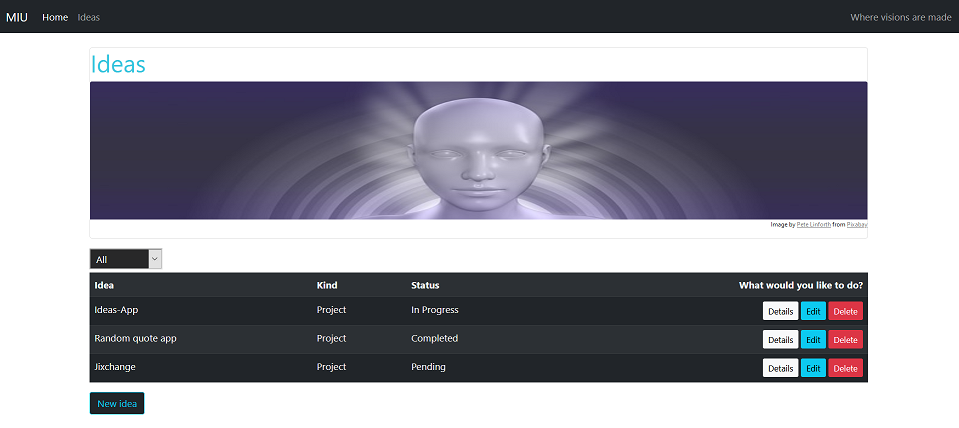

# MIU

## Magical Idea Universe


A Django app that helps you manage and keep track of your ideas and visions with full CRUD functionality.


## List View



The list view provides you with an overview of all ideas in your database. They are sorted according to their name, kind (project, vision, try something), status (pending, in progress, completed), idea description and next steps.

## Create

Add new ideas to your database via the create view.


## Read

The detail view shows you the details of a specific idea


## Update

Via the update view you can edit the details of a specific idea.


## Delete


On the delete screen you can delete a specific idea.

## How to use locally on your computer

- Fork/clone this repository
- Download and install [Python](https://www.python.org/downloads/)
- install Pipenv

```
pip3 install pipenv
```

- open the project folder in your bash and install the latest version of Django with Pipenv

```
pipenv install django
```

Activate the virtual environment

```
pipenv shell
```

- In the project folder create a file named .env on the same level as the manage.py file
- Get a secret key (for example on https://miniwebtool.com/django-secret-key-generator/)
- Enter the secret key **in the .env file** inside the <> like this (your secret key goes where it says 'secret_key'):

```
export SECRET_KEY='<secret_key>'
```

- Migrate

  In your shell, execute the following commands for migrations successively:

```
python manage.py makemigrations ideas
```

```
python manage.py migrate
```

- Start the server

```
python manage.py runserver
```

If everything has worked, your shell should provide you with the address with which to open the app in your browser (http://127.0.0.1:8000/)

<br/>
<br/>

## This is a pet project to play around with Django. It is a work-in-progress and will be updated continuously.
