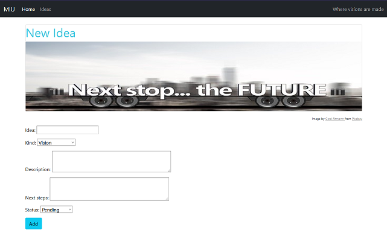

# MIU

## Magical Idea Universe


A Django app that helps you manage and keep track of your ideas and visions with full CRUD functionality.
Keep track of your ideas and visions and sort them by their name, kind of idea (project, vision, try something), status (pending, in progress, completed), description and next steps.


## List Page


The ideas page provides you with an overview of all ideas in your database.
Two dropdown menus let you filter ideas by their status and their kind.

## Create Page

Add new ideas to your database via the create page.


## Detail Page

The detail page shows you the details of a specific idea


## Update Page

Via the update page you can edit the details of a specific idea.


## Delete Page

On the delete page you can delete a specific idea.


## How to use locally on your computer

- Fork/clone this repository
- Download and install [Python](https://www.python.org/downloads/)
- install Pipenv

```
pip3 install pipenv
```

- open the project folder in your shell and install the dependencies with Pipenv. If you don't want to use Pipenv, you can also open the project in a virtual env and use requirements.txt

```
pipenv install
```

- In the project folder create a file named .env on the same level as the manage.py file
- Create a secret key by running the follwing command in your shell. The output string of 50 characters is your secret key. Copy it.

```
python -c "import secrets; print(secrets.token_urlsafe())"
```

- Paste the secret key **in the .env file** like this (your secret key goes where it says 'secret_key'):

```
export SECRET_KEY='secret_key'
```

- Make sure that the database settings in settings.py correspond to the database you would like to use. For using the SQLite database that comes with Django by default, uncomment the two lines for SQLite and mark the MYySQL lines as a comment.
  Otherwise, make sure to take all necessary steps to connect your DB of choice to the app. For using MySQL, you can follow this tutorial: https://morioh.com/p/4a4dc1e50d7d

Activate the virtual environment

```
pipenv shell
```

- Migrate

  In your shell, execute the following commands for migrations:

```
python manage.py makemigrations ideas
```

```
python manage.py migrate
```

- Start the server

```
python manage.py runserver
```

If everything has worked, your shell should provide you with the address with which to open the app in your browser (http://127.0.0.1:8000/)

<br/>
<br/>

## This is a pet project to play around with Django. It is a work-in-progress and will be updated continuously.
